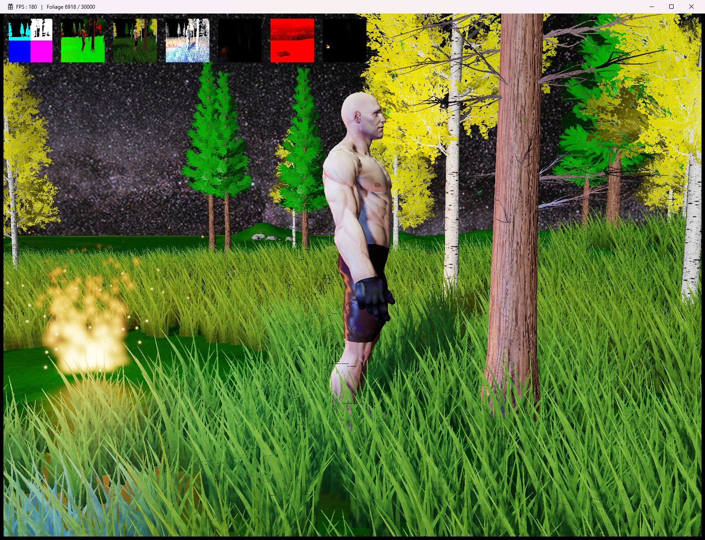

# DX12 Engine

DirectX 12 컴포넌트 기반 자체 엔진.
졸업작품에서 쓰던 커스텀 모델 포맷(`.bin`)과 에셋을 이 엔진으로 이식하면서
렌더링·애니메이션 파이프라인을 구현한 프로젝트입니다.

구현에는 AI 도구를 이용했습니다.



---

## 구현한 것

**렌더링 — 디퍼드 파이프라인**

- `R16G16B16A16_FLOAT` HDR 파이프라인. 조명 누적이 1에서 잘리던 것을 걷어냄
- 블룸 — 소프트 니 임계값, 분리형 가우시안, 1/2 · 1/4 해상도 체인
- ACES 근사 톤매핑 + sRGB 인코딩. 입력 sRGB → 선형 조명 → 출력 인코딩
- 캐스케이드 셰도우 맵 3단 · 4096 아틀라스 · 3×3 PCF · 구간 경계 블렌딩
- 스카이박스 역톤매핑 (이미 톤매핑된 사진에 곡선을 두 번 먹이지 않기)

**GPU 활용**

- 컴퓨트 셰이더 스키닝 + 본 계층 재구성
- GPU 파티클 시뮬레이션, 소프트 파티클, 가산/알파 블렌딩
- 초목 절두체 컬링 → `ExecuteIndirect` (그리기 인자를 GPU가 만든다)
- 컴퓨트 명령을 프레임당 한 번 제출하고 그래픽스 큐가 펜스로 대기

**애니메이션**

- 커스텀 `.bin` 포맷 로더 (본 179 / 스키닝 본 142 / 클립 16)
- SRT 공간 쿼터니언 크로스페이드
- 본 마스크 레이어 블렌딩 (상하체 분리 — 달리면서 공격)
- 2D 블렌드 스페이스 (노드 9개, 위상 공유)

**월드**

- 하이트맵 기반 지형. 경사·높이에서 만든 가중치로 세 층을 섞음
- 인스턴싱 초목 빌보드 — 점 하나를 GS에서 사각형으로, 드로우콜 1회
- `.bin` 모델(나무·바위) 배치, 알파 테스트 잎

1600×1200 기준 초목 30,000장(그림자 포함) · 파티클 300개 · 캐스케이드 3장에서 약 180 FPS.

---

## 빌드

Visual Studio 2022 / Windows 10 SDK / x64.

```
MSBuild Game.sln -t:Engine -p:Configuration=Release -p:Platform=x64
MSBuild Game.sln -t:Client:Rebuild -p:Configuration=Release -p:Platform=x64
```

`Library/Lib/` 의 `.lib` 은 저장소에 없습니다. FBX SDK 라이브러리가 파일 하나에
126~250MB 라 GitHub 의 100MB 제한을 넘습니다. 헤더는 커밋되어 있으므로
[`Library/Lib/README.md`](Library/Lib/README.md) 의 구조대로 `.lib` 만 채우면 빌드됩니다.

실행 파일은 `Output/Client.exe` 로 나오고, 리소스 경로가 `..\Resources\` 기준이라
**작업 디렉터리를 `Output/` 으로 두고 실행**해야 합니다.

---

## 조작

| 키 | |
|---|---|
| `W` `A` `S` `D` | 이동 |
| `Shift` | 걷기 |
| `Q` | 시선 고정 (이동 방향과 바라보는 방향을 분리 — 2D 블렌드 스페이스 확인용) |
| 마우스 좌클릭 | 공격 (상체 레이어) |
| `F1` | 캐스케이드 시각화 |
| `F2` | 초목 절두체 컬링 On/Off |
| `F3` | 초목 그림자 On/Off |

창 제목에 `FPS` 와 초목의 `그린 수 / 심은 수` 가 표시됩니다.

---

## 구조

```
Engine/          엔진. 컴포넌트 · 렌더 패스 · 리소스 · 로더
Client/          진입점
Resources/
  Shader/        .fx (런타임 컴파일)
  Model/         .bin 모델과 텍스처
  Texture/       지형 · 초목 · 파티클 · 스카이박스
  Terrain/       하이트맵
Library/         DirectXTex · FBX SDK (헤더만 커밋)
```

화면 상단의 디버그 뷰는 왼쪽부터 G-Buffer 의 position / normal / albedo,
diffuse light / specular light, shadow, 블룸 버퍼입니다.
